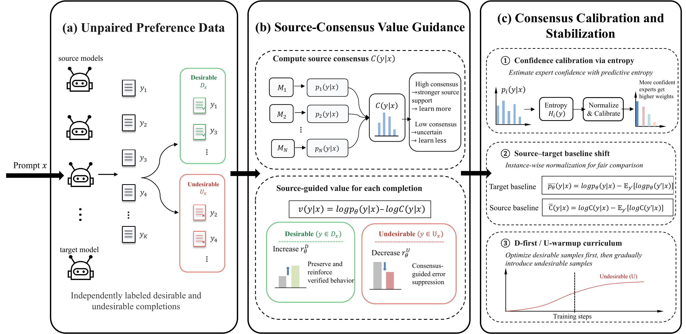

<div align="center">

# Consensus-Guided Preference Optimization for Multi-Source Language Model Alignment

**Anonymous Authors**

[Anonymous Code Repository](https://anonymous.4open.science/r/CGPO-6501/)

</div>

---

## Overview

Domain-specialized language models offer complementary strengths in areas such
as mathematical reasoning, code generation, and instruction following, but
deploying multiple experts together incurs substantial memory, computation, and
inference overhead. Model fusion seeks to transfer these capabilities into a
single deployable target model. Preference-stage fusion is particularly suited
to heterogeneous sources because it can incorporate source responses or
sequence-level probabilities directly into preference alignment, without
requiring compatible parameter spaces or relying only on supervised imitation.

Existing preference-stage fusion methods generally formulate source transfer
through paired chosen--rejected comparisons. When candidate responses have
comparable quality, assigning fixed winner and loser roles can obscure the
supervision associated with each completion. **Consensus-Guided Preference
Optimization (CGPO)** instead learns from independently labeled desirable and
undesirable completions. Verifier labels determine the update direction, the
initial policy anchors desirable completions, and calibrated multi-source
consensus determines the correction priority of undesirable ones. CGPO thereby
transfers complementary source capabilities without constructing artificial
response pairs, while retaining a single target model for deployment.

## Key Highlights

- **Pointwise preference-stage fusion:** Preserve independently assigned
  desirable/undesirable supervision, using verifier labels to specify whether
  each completion should be promoted or suppressed without constructing
  chosen--rejected pairs.
- **Source-Consensus Value Guidance:** Incorporate multi-source probability
  evidence into the pointwise value objective, separating label-defined learning
  direction from source-guided correction priority for undesirable completions.
- **Consensus Calibration and Stabilization:** Use entropy-based confidence
  weighting, prompt-level source--target baseline alignment, and D-first/U-warmup
  to make heterogeneous source guidance reliable during optimization.
- **Broad empirical effectiveness:** Across seven benchmarks spanning
  mathematics, code, reasoning, and instruction following, CGPO achieves the
  best overall average among the compared fusion and preference-optimization
  baselines, improving Phi-3.5 from 58.1 to 63.3.

## Method

[](assets/methods.pdf)

*Overview of CGPO: (a) independently labeled unpaired preference data,
(b) source-consensus value guidance, and (c) consensus calibration, baseline
alignment, and the D-first/U-warmup curriculum. Click the figure for the
print-quality PDF.*

The method follows the same three-part organization as the figure:

1. **(a) Unpaired Preference Data.** Source and target models provide candidate
   completions, which are independently labeled as desirable or undesirable.
   No chosen--rejected pairing is required. Source-informed data construction
   records an offline `source_allocation_weight` that defines the empirical
   sampling distribution within each label.
2. **(b) Source-Consensus Value Guidance.** Each source scores the same raw
   completion with its own tokenizer. Their completion-only, length-normalized
   sequence scores form a consensus. The frozen initial policy anchors
   desirable completions, while aligned source consensus adjusts the correction
   strength of undesirable completions without overriding verifier labels.
3. **(c) Consensus Calibration and Stabilization.** Entropy-based confidence
   calibration assigns completion-specific expert weights. Prompt-level
   source--target baseline alignment removes additive score offsets while
   preserving source-induced ordering. The D-first/U-warmup curriculum then
   introduces source-guided undesirable correction gradually during training.

```text
(a) Unpaired Preference Data
                |
(b) Source-Consensus Value Guidance
                |
(c) Consensus Calibration and Stabilization
                |
      One deployable target model
```

The equation-to-code correspondence is documented in
[`docs/METHOD_TO_CODE.md`](docs/METHOD_TO_CODE.md).

## Models and Data

The main experiments use the following model pool:

| Role | Model | Size |
|---|---|---:|
| Target | `microsoft/Phi-3.5-mini-instruct` | 3.8B |
| Source | `Qwen/Qwen2.5-7B` | 7B |
| Source | `Qwen/Qwen2.5-7B-Instruct` | 7B |
| Source | `google/gemma-2-9b-it` | 9B |
| Source | `Qwen/Qwen2.5-Math-7B-Instruct` | 7B |

The initial policy \(\pi_0\) is the SFT checkpoint derived from the target
backbone and must be supplied explicitly. The main training data are based on
approximately 64K UltraFeedback prompts with response-level feedback preserved
as independent desirable or undesirable labels.

The public scripts consume JSONL rows. A source-informed raw row has the form:

```json
{"prompt_id":"example-001","prompt":"...","completion":"...","label":"D","source_allocation_weight":1.0}
```

See [`docs/DATA_SCHEMA.md`](docs/DATA_SCHEMA.md) for the fields added during
offline scoring and consensus construction.

## Dependencies and Installation

Create a Python 3.10 or newer environment and install the package from the
repository root:

```bash
python -m venv .venv
source .venv/bin/activate

python -m pip install -e ".[test]"
pytest
```

Model scoring and training require a PyTorch environment compatible with the
available accelerator. Model access and hardware placement remain external to
the method implementation.

## Training

### 1. Offline model scoring

Score the training rows under the SFT initial policy and source models:

```bash
python scripts/score_models.py \
  --input data/train.jsonl \
  --output data/scored.jsonl \
  --initial-model INITIAL_POLICY \
  --source-model SOURCE_1 SOURCE_2 SOURCE_3 SOURCE_4
```

The same raw prompts and completions are used across models, while every model
applies its own tokenizer.

### 2. Consensus construction

Fit entropy calibration on a disjoint calibration file and construct aligned
source references:

```bash
python scripts/build_consensus.py \
  --input data/scored.jsonl \
  --calibration-file data/calibration_scored.jsonl \
  --output data/cgpo_train.jsonl \
  --temperature 0.8 \
  --weight-floor 0.02
```

### 3. CGPO optimization

```bash
python scripts/train.py \
  --config configs/main.yaml \
  --data data/cgpo_train.jsonl \
  --model INITIAL_POLICY \
  --output-dir outputs/cgpo
```

Cluster-specific distributed launch settings and generated artifacts are not
embedded in the repository. The paper-reported method settings are recorded in
[`configs/main.yaml`](configs/main.yaml).

## Experiment Configurations

Configuration overlays isolate the experiments reported in the paper:

| Experiment | Configuration |
|---|---|
| Policy-Anchored Reference | `configs/ablations/policy_anchored.yaml` |
| Consensus-Anchored Reference | `configs/ablations/consensus_anchored.yaml` |
| Label-Conditional Reference | `configs/ablations/label_conditional.yaml` |
| No Source Guidance | `configs/ablations/no_source_guidance.yaml` |
| Mean consensus | `configs/ablations/mean_consensus.yaml` |
| No baseline alignment | `configs/ablations/no_baseline_alignment.yaml` |
| No D/U curriculum | `configs/ablations/no_curriculum.yaml` |
| Phi-3-small target | `configs/scales/phi3_small.yaml` |
| Phi-3-medium target | `configs/scales/phi3_medium.yaml` |

Apply an overlay without changing the common training entry point:

```bash
python scripts/train.py \
  --config configs/main.yaml \
  --override-config configs/ablations/policy_anchored.yaml \
  --data data/cgpo_train.jsonl \
  --model INITIAL_POLICY \
  --output-dir outputs/policy_anchored
```

The three reference-assignment variants retain the same source-informed rows
and class-conditional sampling distributions; only the branch references change.
`No Source Guidance` is a broader system control: it uses separately
constructed source-agnostic rows, uniform sampling within each label, and
\(\pi_0\) for both references. Its initial-policy-only scoring path is described in
[`docs/EXPERIMENTS.md`](docs/EXPERIMENTS.md).

## Evaluation

All methods are evaluated with the same benchmark-specific protocol:

| Domain | Benchmark | Setting | Metric | Inference |
|---|---|---|---|---|
| Mathematics | GSM8K | 8-shot CoT | Exact match | Greedy |
| Mathematics | MATH | 0-shot CoT | Exact match | Greedy |
| Mathematics | TheoremQA | 5-shot | Answer-match accuracy | Greedy |
| Reasoning | BBH | 3-shot | Normalized accuracy | MC log-likelihood |
| Reasoning | MMLU | 5-shot | Accuracy | MC log-likelihood |
| Instruction | IFEval | 0-shot | Prompt-level strict accuracy | Greedy |
| Code | MBPP | 3-shot | pass@1 | Greedy |

The protocol is recorded in [`configs/evaluation.yaml`](configs/evaluation.yaml).
Given a JSON object containing the seven percentage scores, reproduce the paper
aggregates with:

```bash
python scripts/summarize_results.py results.json
```

Math Avg. is the unweighted mean of GSM8K, MATH, and TheoremQA; Reasoning Avg.
is the unweighted mean of BBH and MMLU. Overall Avg. is the unweighted mean of
all seven benchmarks, not the mean of the two category averages.

## Results

### Main comparison

All values are percentages. The table reports the category and seven-benchmark
averages from the paper.

| Method | Math Avg. | Reasoning Avg. | Overall Avg. |
|---|---:|---:|---:|
| Target Model | 50.7 | 68.6 | 58.1 |
| FuseLLM | 52.8 | 68.9 | 60.3 |
| SFT | 51.8 | 69.4 | 59.0 |
| SFT-DPO | 52.7 | 69.4 | 59.9 |
| SFT-KTO | 52.7 | 69.7 | 59.5 |
| WRPO | 54.6 | 70.3 | 61.3 |
| InfiFPO | 54.8 | 69.9 | 61.7 |
| **CGPO** | **57.0** | **71.7** | **63.3** |

CGPO improves the 3.8B target from 58.1 to 63.3 Overall Avg. Its individual
benchmark scores are:

| GSM8K | MATH | TheoremQA | BBH | MMLU | IFEval | MBPP |
|---:|---:|---:|---:|---:|---:|---:|
| 84.2 | 53.9 | 32.8 | 70.2 | 73.1 | 54.3 | 74.7 |

### Training efficiency

Gain/h denotes Overall Avg. improvement over the target per GPU hour.

| Method | Overall Avg. | GPU h | Gain/h |
|---|---:|---:|---:|
| FuseLLM | 60.3 | 162 | 0.014 |
| WRPO | 61.3 | 39 | 0.082 |
| InfiFPO | 61.7 | 40 | 0.090 |
| **CGPO** | **63.3** | **36** | **0.144** |

### Reference-assignment variants

These variants share the same source-informed data and class-conditional
sampling distributions.

| Reference assignment | Math Avg. | Reasoning Avg. | Overall Avg. |
|---|---:|---:|---:|
| Consensus-Anchored | 56.9 | 71.2 | 63.1 |
| Policy-Anchored | 56.7 | 71.6 | 62.9 |
| **Label-Conditional (CGPO)** | **57.0** | **71.7** | **63.3** |

Policy-Anchored changes only the reward reference and therefore remains
distinct from the end-to-end No Source Guidance control, whose Overall Avg. is
59.9.

### Target-model scale

| Target | Target Overall Avg. | CGPO Overall Avg. | Gain |
|---|---:|---:|---:|
| Phi-3.5-mini (3.8B) | 58.1 | 63.3 | +5.2 |
| Phi-3-small (7B) | 63.8 | 67.8 | +4.0 |
| Phi-3-medium (14B) | 66.1 | 68.6 | +2.5 |

Additional component-ablation interpretation and the qualitative case study
are provided in the paper appendix. Repository-side experiment notes are in
[`docs/EXPERIMENTS.md`](docs/EXPERIMENTS.md).

## Repository Structure

```text
CGPO/
├── assets/
│   ├── methods.pdf            # Print-quality paper method figure
│   └── methods.png            # README preview
├── configs/
│   ├── main.yaml              # Main method and model pool
│   ├── evaluation.yaml        # Benchmark protocol and aggregation
│   ├── ablations/             # Component and reference controls
│   └── scales/                # Target-model scale overlays
├── src/cgpo/
│   ├── consensus.py           # Entropy calibration and baseline alignment
│   ├── objective.py           # References and class-conditional CGPO loss
│   ├── scoring.py             # Completion-only scoring and anchor construction
│   └── io.py                  # JSONL and YAML helpers
├── scripts/
│   ├── score_models.py        # Offline initial-policy/source scoring
│   ├── build_consensus.py     # Calibrated and aligned consensus
│   ├── train.py               # Compact Transformers/PEFT training entry point
│   ├── summarize_results.py   # Paper-compatible score aggregation
│   └── audit_release.py       # Anonymous-release audit
├── docs/
│   ├── DATA_SCHEMA.md
│   ├── METHOD_TO_CODE.md
│   ├── EXPERIMENTS.md
│   └── RELEASE_CHECKLIST.md
├── tests/                     # Formula and experiment-contract tests
├── pyproject.toml
├── requirements.txt
└── LICENSE
```

Local datasets, checkpoints, model weights, logs, and generated outputs are
excluded through `.gitignore`.

## License

The code in this repository is released under the [MIT License](LICENSE).
Model weights and benchmark datasets remain subject to their respective
licenses and access conditions.
